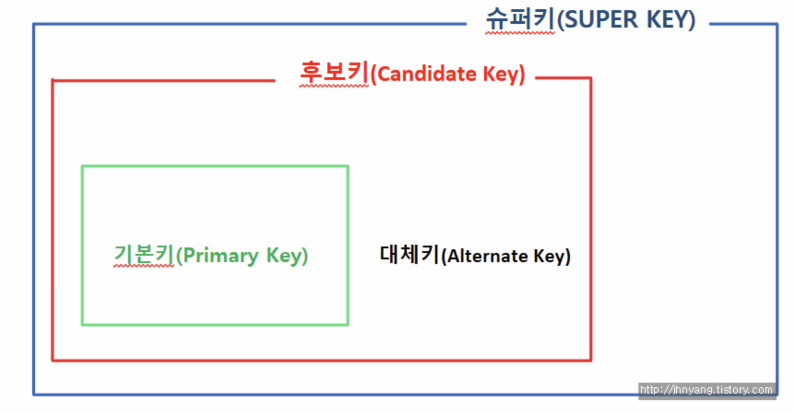

# 키란?
- 키는 데이터베이스에서 조건에 만족하는 튜플을 찾거나 순서대로 정렬할 때 다른 튜플들과 구별할 수 있는 
유일한 기준이 되는 속성이다. 

## 기본 키
- 기본 키는 "주민등록번호"처럼 테이블의 각 레코드(행)들을 고유하게 식별해주는 역할이다.
    - 기본키는 항상 테이블에서 고유한 값을 가져야 한다.
    - 널(Null) 값을 가지고 있지 않아야 한다.
    - 빠른 검색을 위해 작은 정수 값이나 짧은 문자열을 갖는 속성을 기본키로 선정하는 것이 좋다.
    - 테이블의 기본키는 하나만 만들 수 있다.
    - 속성의 값이 변경될 가능성이 높은 속성은 기본 키로 선정하지 않는 것이 좋다. (boolean 값이라던가?)
    
## 후보 키
- 후보 키란 기본 키가 될 수 있는 후보들을 말한다. 기본키는 이 후보들 중에 하나가 채택된 것
    - 즉 후보키란 테이블에서 각 튜플들을 구별하는 데 기준이 되는 하나(기본 키) 혹은 그 이상의 칼럼들의 집합
    - 예를들면 모든 사람이 휴대폰을 가지고 있다는 가정하에 휴대폰 번호는 중복될 수 없고 null이 될 수 없으니 
    사람 테이블의 주민등록번호와 휴대폰 번호가 후보키가 될 수 있다.
    
    
## 대채 키
- 후보키에서 기본키로 사용될 역량을 가졌지만 선택되지 못한 휴대폰 번호같은 경우를 대채 키라고 한다.
- 선택되지 못했지만 자격이 있어 언제든지 대체될 수 있다.
    - 따라서 하나의 후보키가 기본 키로 선택되면 다른 후보키들은 대체키가 되는 것이다.
    
## 복합 키
- 각 튜플들을 식별할 수 있는 두개 또는 그 이상의 속성들로 구성된 후보키

## 슈퍼 키

- 슈퍼키는 투플의 키 기능만 하면 된다. 특정 튜플을 고유하게 식별할 수만 있으면 되는데 예로 들었던 사람 테이블에서 
(주민등록번호, 이름)도 해당 튜플을 유일하게 식별하게 해주므로 슈퍼키가 된다. 하지만 주민등록번호만으로도 
테이블을 식별할 수 있으므로 "유일성"은 만족하지만 "최소성"을 만족하지 못해 후보키는 될 수 없는 것이다.
    - 최소성 : 키를 구성하는 속성 하나를 제거하면 유일하게 식별할 수 없도록 꼭 필요한 최소의 속성으로 구성된 것

- 즉 유일성과 최소성을 만족하면 후보키, 유일성만 만족하면 슈퍼키로 분류되는 것
