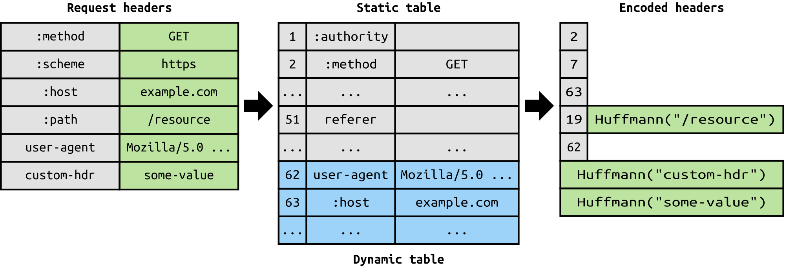

# HTTP2

## HTTP/1.1
- HTTP는 웹상에서 Client ( Internet Explorer, Chrome, Firefox) 와 Server ( 웹서버 eg: httpd, nginx, etc...)간 
 통신을 위한 Protocol이다. 
 1996년 처음 1.0버전이 release되고 1999년 현재 우리가 공식적으로 가장 많이 사용하고 지원하는 버전인 1.1이 출시된 이후 
 15년동안 발전없이 사용되고 있다. 
 현재의 웹은 다량의 멀티미디어 리소스를 처리 해야하고 웹페이지 하나를 구성하기 위해 다수의 비동기 요청이 발생되고 있기 때문에 
  이를 처리하기엔 HTTP/1.1 스펙은 너무 느리고 비효율적이다. 
특히 요즘과 같은 모바일 환경에선 더욱더 HTTP1.1의 스펙은 비효율적이다.

- 우선 HTTP/1.1의 동작방식에 대해 알아보자. 

 HTTP/1.1은 기본적으로 1번의 연결로 1개의 리소스를 요청할 수 있다. 그래서 동시 요청이 어렵고 느리다. 
 그래서 위 그림과 같이 동시전송이 불가능하고 요청과 응답이 순차적으로 이루어 지게된다. 
그렇다 보니 HTTP문서안에 포함된 다수의 리소스 (Images, CSS, Script)를 처리하려면 요청할 리소스 개수에 비례해서 Latency(대기 시간)는 길어지게 된다. 

- 이러한 HTTP/1.1의 connection당 하나의 요청처리를 개선할 수 있는 기법중 pipelining이 존재하는데 이것은 하나의 Connection을 통해서 
 다수개의 파일을 요청/응답 받을 수 있는 기법을 말하는데 이 기법을 통해서 어느정도의 성능 향상을 꾀 할 수 있으나 큰 문제점이 하나 있다. 
하나의 TCP연결에서 3개의 이미지(a.png, b.png, c.png)를 얻을려고 하는경우 HTTP의 요청순서는 다음 그림과 같다.

            | --- a.png --- |
            
                        | --- b.png --- |
            
            
                                    | --- c.png --- |

순서대로 첫번째 이미지를 요청하고 응답받고 다음 이미지를 요청하게 되는데 만약 첫번째 이미지를 요청하고 응답이 지연되면 
아래 그림과 같이 두,세번째 이미지는 당연히 첫번째 이미지의 응답처리가 완료되기 전까지 대기하게 되며 이와 같은 현상을 
 HTTP의 __HOL (Head Of Line) Blocking__ - 특정 응답의 지연 이라 부르며 파이프 라이닝의 큰 문제점 중 하나이다.

            | ------------------------------- a.png --------------- --- |
            
                                                                   | -b.png- |
            
            
                                                                           | --c.png-- |

- 또한 하나의 connection에 하나의 요청을 처리하다보니 매 요청별로 connection을 만들게 되고 TCP상에서 동작하는 HTTP의 특성상 
 3-way Handshake 가 반복적으로 일어나고 또한 불필요한 RTT증가와 네트워크 지연을 초래하여 성능을 저하 시키게 되고 
이러한 현상을 RTT( Round Trip Time ) 증가라고 한다.

- 마지막으로 http/1.1의 헤더에는 많은 메타정보들이 저장되어져 있다. 사용자가 방문한 웹페이지는 다수의 http요청이 발생하게 되는데 
이 경우 매 요청시 마다 중복된 헤더값을 전송하게 되며(별도의 domain sharding을 하지 않았을 경우) 또한 해당 domain에 설정된 cookie정보도 
매 요청시 마다 헤더에 포함되어 전송되며 어쩔땐 요청을 통해서 전송하려는 값보다 헤더 값이 더 큰경우도 비일비재 하다. 
__이처럼 HTTP/1.1의 무거운 Header 구조 (특히 Cookie) 도 현재의 웹 환경에서는 매우 비효율적인 요소로 꼽힌다.__

- 이러한 http/1.1의 문제점과 비효율성을 극복하기 위해 Image Spriting, Domain Sharding, Minify CSS/Javascript, 
Data URI Scheme, Load Faster 등의 방법이 나왔지만 근본적인 문제점을 해결할수는 없었고, 
새로운 프로토콜이 아닌 HTTP/1.1에서 성능을 개선한 HTTP/2가 나오게 된다.
    - 공식 문서에서는 브라우저와 웹 사이트 간의 단일 연결을 허용하는 것이 주요 목적이라고 언급하고 있다.
    

## HTTP/2의 주요 특징

- Multiplexed Streams
    - 한 커넥션으로 동시에 여러개의 메세지를 주고 받을 있으며, 응답은 순서에 상관없이 stream으로 주고 받는다. 
     HTTP/1.1의 Connection Keep-Alive, Pipelining의 개선이라 보면 된다.
     
     

- Stream Priority
    - 예를 들면 클라이언트가 요청한 HTML문서안에 CSS파일 1개와 Image파일 2개가 존재하고 이를 클라이언트가 각각 요청하고 난 후 
    Image파일보다 CSS파일의 수신이 늦어지는 경우 브라우저의 렌더링이 늦어지는 문제가 발생하는데 HTTP/2의 경우 리소스간 의존관계(우선순위)를 지정하여 
    예를들면 script보다 CSS를 먼저 받을 수 있도록 지정할 수 있어 화면 렌더링을 좀 더 빠르게 할 수 있는 장점이 있다.

- Header Compression
    - HTTP/2는 Header 정보를 압축하기 위해 Header Table과 Huffman Encoding 기법을 사용하여 처리하는데 이를 HPACK 압축방식이라 부르며 
     별도의 명세서(RFC 7531)로 관리하고 있다. 
    
    
    위 그림처럼 클라이언트가 두번의 요청을 보낸다고 가정하면 HTTP/1.x의 경우 두개의 요청 Header에 중복값이 존재해도 그냥 중복 전송한다. 
    하지만 HTTP/2에선 Header에 중복값이 존재하는 경우 Static/Dynamic Header Table 개념을 사용하여 중복 Header를 검출하고 
    중복된 Header는 index값만 전송하고 중복되지 않은 Header정보의 값은  Huffman Encoding 기법으로 인코딩 처리 하여 전송한다.

- Server Push
    - 서버는 클라이언트의 요청에 대해 요청하지도 않은 리소스를 마음대로 보내줄 수 도 있다. 
    예를들어 클라이언트(브라우저)가 HTML문서를 요청했고 해당 HTML에 여러개의 리소스(CSS, Image...) 가 포함되어 있는경우 
    HTTP/1.1에서 클라이언트는 요청한 HTML문서를 수신한 후 HTML문서를 해석하면서 필요한 리소스를 재 요청하는 반면 
    HTTP/2에선 Server Push기법을 통해서 클라이언트가 요청하지도 않은 (HTML문서에 포함된 리소스) 리소스를 Push 해주는 방법으로 
    클라이언트의 요청을 최소화 해서 성능 향상을 이끌어 낸다. 
    이를 PUSH_PROMISE 라고 부르며 PUSH_PROMISE를 통해서 서버가 전송한 리소스에 대해선 클라이언트는 요청을 하지 않는다.
    
    
    

## 두 프로토콜의 성능비교
- 테스트 환경과 각각 테스트시 외부 인터넷 품질등의 영향으로 정확하게 알 수는 없지만, 일반적으로 HTTP/2를 사용만 해도 
 웹 응답 속도가 HTTP/1.1에 비해 15~50%가 향상 되고, 둘 간의 효율성 차이가 90%이상 나기도 한다.
