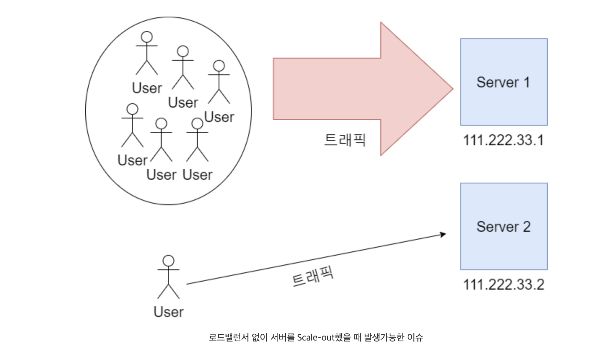
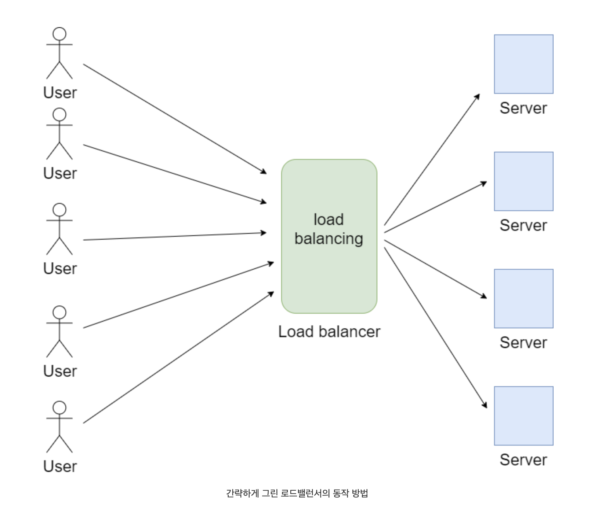
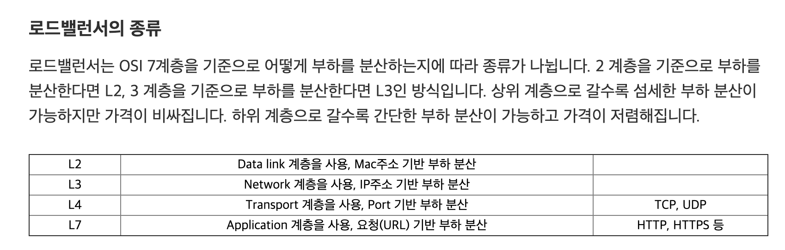

# 로드밸런서

## 로드밸런싱이 왜 필요할까?

- 서버가 단 하나만 존재할 때 수천만명의 사람들이 서버에 동시 접속하면 어떻게 될까?  
하나의 서버는 부하를 감당하지 못할 수도 있을 것이다. 이를 해결하는 방식에는 장비를 업그레이드하는 Scale-up방식과 
장비를 여러개 두는 Scale-out방식이 있다. 

- Scale-up방식은 비용이 많이 들태고, Scale-out 방식으로 여러 서버를 둔다면 해당 서비스에 접근하기 위해서는 서버마다 
 존재하는 다른 IP가 필요할 것이다. 
 서버마다 다른 공인 IP를 부여한다면 사용자들마다 각각 다른 IP로 접속할 것이고, 개발자가 원하는 방식대로 부하를 분산하기 어려워진다. 
 예를 들어 100명의 사용자가 존재하고 2대의 서버가 있다면 99명의 사용자가 서버 1에 접속하고 1명의 사용자가 서버 2에 접속할 수도 있는 것이다.

- 이를 방지하기 위해 서버를 분산하고 가해지는 부하를 적절하게 분산하는 작업이 필요하다. 
개발자가 의도한 대로 부하가 서버마다 골고루 분산되어야 각 서버가 적절하게 부하를 담당할 수 있을 것이다. 
이렇게 두 개 이상의 컴퓨터 자원에 작업을 나누는 것을 로드밸런싱(load balancing)이라고 하고 
작업을 담당하는 장비를 로드밸런서(load balancer)라고 부르는 것이다.

- 즉 로드밸런싱(Load Balancing) 이란?

            로드밸런싱은 부하 분산을 위해서 가상IP를 통해 여러 서버에 접속하도록 분배하는 기능
            하나의 서비스에 발생하는 트래픽이 많을 때, 여러 대의 서버가 분산처리하여 
            서버의 로드율 증가/부하량/속도저하를 고려해서 적절히 요청을 분산시켜주는 서비스
            동시에 오는 수많은 커넥션을 처리하고, 해당 커넥션이 요청 노드 중의 하나로 분산되어 전달하는 것
            대용량 서비스를 운영하기위해서 로드밸런싱은 필수

## 로드밸런서의 종류
- 로드밸런서는 OSI 7계층을 기준으로 어떻게 부하를 분산하는지에 따라 종류가 나뉜다. 
2 계층을 기준으로 부하를 분산한다면 L2,  
3 계층을 기준으로 부하를 분산한다면 L3인 방식이다. 
 상위 계층으로 갈수록 섬세한 부하 분산이 가능하지만 가격이 비싸진다.  
 하위 계층으로 갈수록 간단한 부하 분산이 가능하고 가격이 저렴해진다. 

## 로드밸런서의 주요 기능
- 로드밸런서는 3가지의 주요 기능을 통해 로드밸런싱을 진행한다.

- Network Address Translation(NAT)

            Private IP를 Public IP로 바꿈

 - Tunneling

            데이터를 캡슐화하여 연결된 노드만 캡슐을 해제할 수 있게 만듦

 

- Dynamic Source Routing protocol(DSR)

            요청에 대한 응답을 할 때 로드밸런서가 아닌 클라이언트의 IP로 응답

- 즉 사용자가 서비스를 요청하면 L4로 전달된 목적지 IP주소를 real server IP주소로 변조하고 MAC주소를 변조해서 
 목적지를 찾아가는 방식

## 로드밸런서가 서버를 선택하는 방법
- Round Robin

        
            요청을 순서대로 각 서버에 균등하게 분배하는 방식,
            요청이 들어오는 대로 서버마다 균등하게 요청을 분배합니다. 
            가장 단순한 분배 방식.
            서버 커넥션 수나 응답시간에 상관없이 모든 서버를 동일하게 처리
            TCP/UDP 포트 이용하여 로드밸런싱
            가장 빠른 속도를 가진다.
 

- Least Connection

        
            서버마다 연결된 커넥션이 몇개인지 체크하여 커넥션이 가장 적은 서버로 요청을 분배하는 방식.

 

- Weighted Least Connections

            Least Connection방식으로 분배하지만 서버 가중치에 따라 요청을 더 분배하기도, 덜 분배하기도 한다.
            서버 가중치는 사용자가 지정할 수 있고 동적으로 조정되기도 한다.
            서버 풀에 존재하는 서버들의 사양이 일관적이지 않고 다양한 경우 이 방법이 효과적.

 

- Fastest Response Time

            서버가 요청에 대해 응답하는 시간을 체크하여 가장 빠른 서버로 요청을 분배하는 방식.

 

- Source Hash Scheduling

            사용자의 IP를 해싱한 후 그 결과에 따라 서버로 요청을 분배. 
            사용자의 IP는 고정되어 있기 때문에 항상 같은 서버로 연결된다는 보장을 받을 수 있다.

## 로드밸런서 단점

- 로드밸런서를 사용하면 세션 데이터 관리하는게 쉽지 않다. 
매 요청마다, 다른 서버로 접근하기 때문에, 정보 일관성 유지가 힘듬 
세션 고정이 필요하다, 특정 사용자의 요청이 전달될 노드를 고정시키는 방법이 존재하지만, 
해당 노드에서 장애가 발생하면 고정이 의미가 없다.

## 로드 밸런서 장애 대비
- 서버를 분배하는 로드 밸런서에 문제가 생길 수 있기 때문에 로드 밸런서를 이중화하여 대비한다.