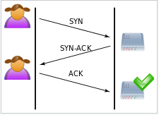

# TCP란

- TCP란 데이터 통신을 위한 프로토콜의 일종, Transport Layer에서 사용하는 프로토콜로 하위 계층에 사용되는 
 IP와 엮어 TCP/IP라고도 표현한다. 
    - IP는 인터넷상의 주소 규칙. 집의 주소를 부여하는 규칙이 존재하듯이, 인터넷상에 연결된 모든 컴퓨터의 위치에도 규칙이 필요하다. 
    이전에는 2⁸*4자리의 주소인 IPv4를 사용하였지만 주소가 고갈이 되고 있어서 16⁴*8자리인 IPv6로 전환하고 되고 있다.
    
- 즉 데이터의 송수신을 위해 IP를 사용하는 프로토콜이며, TCP는 UDP의 비해서 복잡하지만 신뢰성이 높다. 
 또한 Connection Oriented Service(연결지향, 신뢰성)로 가상 회선방식을 제공하고 Flow Control, Congestion Control를 제공한다. 
 이를 통해 TCP는 높은 신뢰성을 보장한다.
 
- TCP는 IP가 처리할 수 있도록 데이터를 여러 개의 패킷으로 나누고 도착지에서는 완전한 데이터로 패킷들을 재조립 해야한다. 
즉, 데이터를 작게 나누어서 한쪽에서 다른쪽으로 옮기고, 이를 다시 조립하여 원래의 데이터로 만드는 규칙이다.  
이 자른 세그먼트(패킷 - 정보를 전달하는 단위)에 순서를 부여하여 전송, 수신하여 순서가 뒤바뀌는 일이 없도록 하고 
손실된 패킷을 확인하고, 재전송을 요청하고 있으며 패킷이 왔다갔다하며 순번이 뒤바뀌는 경우에도 복구하여 
상위층이 신뢰할수 있는 연결방식을 제공한다.
    - 패킷이 전송된 것을 보장하기 위해서 TCP는 ACK(acknowledgment : 패킷을 받았다라고 응답하는 것)라는 것을 사용하여 
     패킷을 보냈는데도 상대 상대편에서 분실이 되어 데이터가 완벽하지 않을때 수신지에서 ACK를 보내 줄 때까지 다시 데이터를 보낸다.

- TCP 서버 특징

            서버소켓은 연결만 담당한다.
            서버와 클라이언트는 1대1로 연결된다.
            스트림 전송으로 전송 데이터의 크기가 무제한이다.
            패킷에 대한 응답을 해야하기 때문에(시간 지연, CPU 소모) 성능이 낮다.
            Streaming 서비스에 불리하다. (손실된 경우 재전송 요청을 하므로)
            신뢰성이 있는것은 패킷의 분실이나 중복, 순서가 바뀌는 것 등의 문제를 해결해 주는 것입니다
            TCP/IP 구조의 통신은 전부 통신 경로 상에서 엿볼 수 있다. 패킷을 수집하는 것만으로 도청할 수 있다.

## TCP 연결과 해제

- TCP는 연결시에 3 Way HandShake 를 사용하고 해제시에는 4 Way HandShake 를 사용한다.

- 연결 과정은 아래와 같다

            1. 클라인터가 서버에게 연결 요청 메시지 전송(SYN)
            2. 서버가 수락하고 (SYN + ACK) 를 보낸다
            3. 클라이언트가 다시 ACK를 보내고 연결을 맺는다

- 해제 과정은 아래와 같다

            
            1. 클라이언트가 연결을 종료하겠다는 FIN 플래그 전송
            2. 서버는 ACK를 보내고, 자신의 통신이 끝날 때까지 기다린다.(TIME_WAIT)
            3. 서버가 통신이 끝나면, 연결이 종료됬다고 FIN플래그 전송
            4. 클라이언트는 확인했다는 ACK를 보내고 종료한다.

# UDP란

- User Datagram protocol의 약자로 데이터를 데이터그램 단위로 처리하는 전송계층의 프로토콜이다.
- TCP와 달리 비연결성, 비신뢰성 전송 프로토콜로서 헤더의 CheckSum 필드를 통해 최소한의 오류만 검출한다. 
TCP와는 다르게 데이터를 패킷으로 나누고 반대편에서 재조립하는 과정을 거치지 않으며 수신지에서 제대로 받던 받지 않던 
상관안하고 데이터를 보내기만 한다.

- 그래서 목적지에 도달하려고 하지만 (Best-effort) 에러가 날 수도 있고 재전송이나, 순서 뒤바뀜에 대한 대체는 
어플리케이션에서 처리해 주어야 한다.

- 별도의 연결 설정이나 해제 과정이 존재하지 않고, ACK메시지를 통해서 확인을 받거나 하는것이 없기 때문에 TCP 프로토콜 보다는 
더 빠른 속도를 낼수 있으며 이러한 빠른 속도로 UDP는 실시간 방송 등을 위해 사용을 되고 한 두장의 프레임이 빠저도 보정이 가능하다. 
또한 서버는 클라이언트와 1대 다로 연결 될 수 있다.
