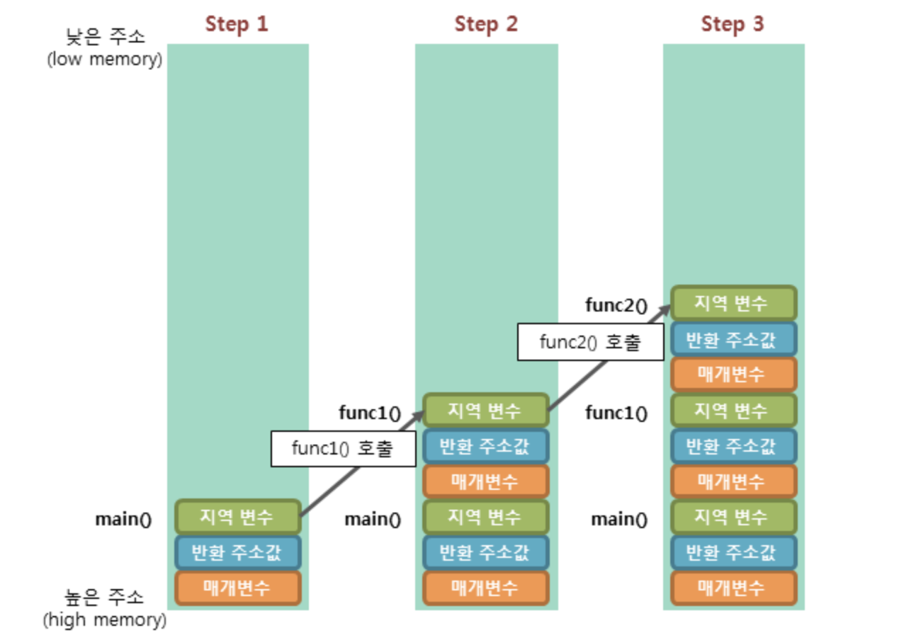

# 함수

- 함수는 인자전달방식에 따라 크게 값에 의한 전달(Call by value)와 참조에 의한 전달(Call by reference)로 나뉜다.
    - 파이썬은 두 방식을 사용하지 않음.

- 함수가 호출될 때 메모리에는 "스택 세그먼트 공간"에 "스택 프레임"이 생긴다. 
    - 스택 프레임은 함수의 메모리 공간, 즉 지역변수가 존재하는 영역
    - 함수를 호출한 다음 복귀할 주소값 등 지역변수 이외의 정보도 담고있다.
    - 함수가 종료되면 해당 공간은 사라진다.
    

- 각 함수의 스택 프레임은 서로 독립된 공간이다. 
함수에서 다른 함수로 인자를 전달할 때 값을 "복사"해 전달하는 "경우를 값에 의한 전달"이라 한다. 
"복사" 했기 때문에 원래 함수의 지역변수에 영향을 미치지 않는다. 
복사된 인자는 함수 안에서 지역적으로 사용되는 local value의 특성을 가진다.     
따라서 함수 안에서 인자의 값이 변경되어도, 외부의 변수의 값은 변경되지 않는다.

- 인자로 변수의 참조(주소값) 을 전달하는 방식을 "참조에 의한 전달"이라고 한다. 
call-by-reference 참조에 의한 호출방식은 함수 호출시 인자로 전달되는 변수의 레퍼런스를 전달한다.(해당 변수를 가르킨다.) 
따라서 함수 안에서 인자의 값이 변경되면, 아규먼트로 전달된 객체의 값도 함께 변경된다.

## Java에서는?

            함수에 전달되는 인자의 데이터 타입에 따라서 (원시자료형 / 참조자료형) 함수 호출 방식이 달라진다.
            원시 자료형 (primitive type) : call-by-value 로 동작 (int, short, long, float, double, char, boolean )
            참조 자료형 (reference type): call-by-reference 로 동작 (Array, Class Instance)
## 파이썬에서는?

- 파이썬은 "객체 참조에 의한 전달" 이라는 방식을 사용한다. 
함수를 호출할 때 인자로 전달된 객체를 일단 참조한다.
    - 파이썬의 변수는 C언어처럼 변수라는 메모리공간에 값을 직접 지정하지 않는다. 
    변수 이름이 값 객체를 가리킨다. 즉 변수가 값이 있는 메모리 공간을 참조한다.
    
                
                C언어
                int i = 0
                i라는 이름을 가진 메모리공간에 0이 담겨있는 것
                
                파이썬
                i = 0
                0이 담겨있는 메모리공간을 i라는 변수가 해당 메모리공간의 주소를 바라보고 있는 것
    
- 즉 파이썬에서 변수 값을 바꾼다는 의미는 변수 이름이 가리키는 메모리 공간의 값을 직접 바꾸는게 아니라 
변수 이름이 바꾸고자하는 객체를 가리키도록 변경하는 것이다.

            i = 0 에서 i = 1로 바꿀 때 i는 0이 담겨있는 메모리공간을 가리키고 있다가
            1이 담겨있는 메모리 공간을 가리키도록 변경하는 것           

- 파이썬에서는 객체타입에 따라 방식이 다르다.            
    - immutable object
    
    
                int, float, str, tuple
                immutable 객체가 함수의 arguments로 전달되면 처음에는 call by reference로 받지만, 
                값이 변경되면 call by value로 동작한다.
                즉 함수 내에서 formal parameter 값이 바뀌어도, actual parameter에는 영향이 없다.
    
    - mutable object
    
    
                list, dict, set
                mutable 객체가 함수의 argument로 넘어가면 call by reference로 동작한다.
                즉, object reference가 전달되어 actual parameter의 값에 영향을 미칠 수 있다.