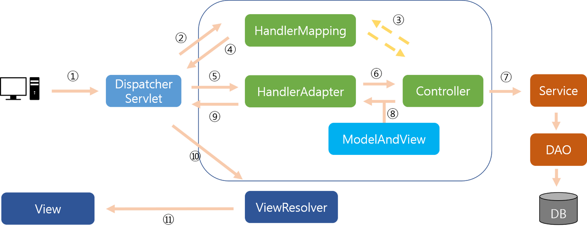

# Spring MVC

- spring mvc의 구조

## Request - Response 흐름
① 클라이언트가 DispatcherServlet에 요청을 한다.

② 그러면 DispatcherServlet 가 HandlerMapping에게 그 요청을 보내고,

③ HandlerMapping는 그 일을 해줄 Controller를 찾는다.

④ 그러고나서 HandlerMapping은 DispatcherServlet에게 그 Controller를 알려주고,

⑤ DispatcherServlet은 HandlerAdapter에게  찾은 Controller에 어떤 메서드를 쓸건지 HandlerAdapter에게 물어본다.

⑥ HandlerAdapter 는 Controller 에 있는 메소드를 찾고,

⑦ Controller는 그 메서드를 수행한다. 이때 Service, DAO 등의 객체를 이용해 DB작업을 보통한다.

⑧ 찾은 메서드로 작업을 하고나면 결과를 HandlerAdapter에게 보내주는데, 이때 보통 ModelAndView라는 놈을 이용해서 데이터(Model) 와 View 이름을 리턴해준다.

⑨ HandlerAdapter는 그 값을 DispatcherServlet에게 리턴해준다.

⑩ DispatcherServlet이 이제 View이름을 아니깐 ViewResolver에게 그 이름을 통해 View를 찾으라고 시킨다.

⑪ 그러면 ViewResolver은 View 를 찾고 , 그 View에서는 만들어진 데이터(Model) 값으로 화면의 내용을 구성해서 클라이언트에게 보여준다.

## Spring Boot에서 RESTful방식의 @RestController을 사용할 때

- @RestController 에서 return 되는 값은 View Page를 통해 출력되는 것이 아니라 HTTP ResponseBody에 직접 쓰여지게 된다.

## Spring Boot에서 RESTful방식의 @Controller을 사용할 때

- 사용자의 요청이 오면 등록된 ViewResolver를 통해 사용자에게  text/html 타입의 응답을 보내주게 된다.

- 즉 @Controller 는 View Page를 반환하지만, @RestController는 객체(VO,DTO)를 반환하기만 하면, 
 객체데이터는 MessageConverter에 의해서 application/json 형식의 HTTP ResponseBody에 직접 작성되게 된다.